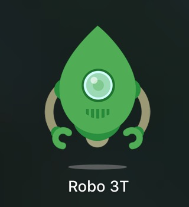

> 本文基于MacOS系统,基本的开发环境安装配置如果没有安装好请自行百度安装
### ----------前后端配置安装（MacOS）-------------

##### 后台数据库 mongoDB 安装
>使用homebrew安装mongodb
- brew install mongodb
- mongo --version 查看安装版本
- 新版开箱即用,不用像之前要配什么DB文件了（系统环境可能需要配置一下）
- 已默认配置启动 mongod --config /usr/local/etc/mongod.conf
- mongo 图形界面
- 推荐界面管理工具 [RoBo3T](https://robomongo.org/)

- 后台启动mongodb用工具成功连接数据库

##### 后端基于node,express开发,后台代码-service文件夹中

> 本地后台服务开发调试 nodemon 启动后台(后台代码更新自动重启服务器),安装
npm install -g nodemon

> 数据库mongodb,mongodb配合express使用需要插件mongoose
npm i mongoose -S

```
const mongoose = require('mongoose')
const DB_URL = 'mongodb://127.0.0.1:27017/cmm'

//链接数据库
mongoose.connect(DB_URL)
mongoose.connection.on('connected', () => {
  console.log('数据库链接成功')
})

```


### --------------界面--------------
<!--  -->

### --------------前端开发--------------
-安装依赖
-配置redeux开发调试
```
import { Provider } from 'react-redux'
import { createStore,applyMiddleware,compose } from 'redux'
import thunk from 'redux-thunk'
import App from './App';
import { AppStore } from '@/store';

let store = createStore(rootReducer,
compose(
    applyMiddleware(thunk),
    window.__REDUX_DEVTOOLS_EXTENSION__ && window.__REDUX_DEVTOOLS_EXTENSION__()
  )  
)

ReactDOM.render(
  <Provider store={store}>
    <App />
  </Provider>,
  document.getElementById('root')
);

```

- 使用 connect 链接 组件与 状态中心, connect接收两个参数（其实有4个数据）
> 1-映射数据 可以理解为 state 
> 2-映射方法 

```
import { connect } from "react-redux";

```

### create-react-app 中使用装饰器
安装 
```
npm install --save-dev @babel/plugin-proposal-decorators
配置（ npm run eject )
```
  "babel": {
    "presets": [
      "react-app"
    ],
    "plugins": [
      [
        "@babel/plugin-proposal-decorators",
        {
          "legacy": true
        }
      ],
      [
        "import",
        {
          "libraryName": "antd",
          "style": "css"
        }
      ]
    ]
  },
```


```

### --------------服务器后台--------------


> 基于node,express开发

- app.get,app.post,开发get和post接口
- app.use使用模块
- res.send;res.json;res.sendfile


> mongodb配合express进阶

- mongodb独立工具函数

- express使用body-parser支持post参数

- 使用cookie-parser储存登录信息cookie

>密码 cmd5加密+加严 安装 npm i utility -S

